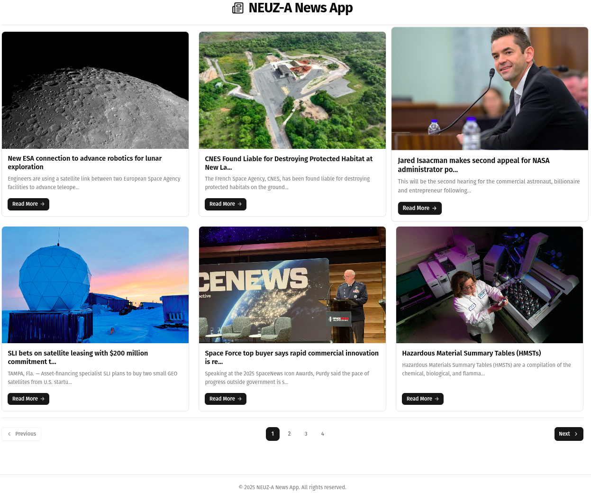

# Project Summary:

A modern News Web App that displays articles in a card-style layout.\
Built completely using React for structure, TailwindCSS for styling, and TypeScript for functionality.

News data is fetched dynamically using [NEWS API](https://api.spaceflightnewsapi.net)

## Key Features:

A clean grid layout showing multiple news cards per page

Each card includes:\
✔ thumbnail image\
✔ short headline\
✔ brief summary\
✔ “Read More” link

Page navigation using Previous and Next buttons\
Responsive layout for desktop

